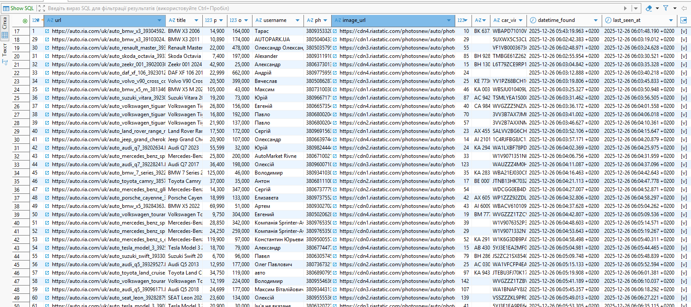

# AutoRia Async Scraper

An **asynchronous web scraper** for **auto.ria.com** that:

- collects car sale listings,
- parses detailed car information,
- asynchronously fetches seller phone numbers,
- stores data in **PostgreSQL**,
- **updates listings daily at configured time (default 12:00)**,
- creates database dumps on schedule.

## Tech Stack

- **Python 3.11+**
- **asyncio**
- **httpx**
- **lxml**
- **Playwright**
- **SQLAlchemy (async)**
- **PostgreSQL**
- **Docker / docker-compose**
- **APScheduler**

## Stored Data

Table `cars` contains:

- `url` - unique listing URL  
- `title`
- `price_usd`
- `odometer`
- `username`
- `phone_number`
- `image_url`
- `images_count`
- `car_number`
- `car_vin`
- `datetime_found`
- `last_seen_at`
- `is_active`

## Configuration (`.env`)
Create `.env` file based on `.env.example`:

```env
BASE_URL=https://auto.ria.com/uk/car/used/
SCRAPE_TIME=12:00

POSTGRES_HOST=localhost
POSTGRES_PORT=5432
POSTGRES_DB=autoria
POSTGRES_USER=autoria
POSTGRES_PASSWORD=autoria

DUMP_TIME=12:00
DUMPS_DIR=dumps

WORKERS_COUNT=5
PHONE_WORKERS=1
QUEUE_MAXSIZE=100
MAX_PAGES=500
```

## Run PostgreSQL with Docker
```bash
docker compose up -d
```
***Check containers:***
```bash
docker compose ps
```

### Initialize Database
***Create tables:***
Windows:
```bash
python -m app.init_db
```
Linux / macOS:
```bash
python3 -m app.init_db
```

***Check database manually:***
```bash
docker exec -it autoria_db psql -U autoria -d autoria
```
***sql***
```bash
\dt
SELECT COUNT(*) FROM cars;
```
## Run Scraper
Windows:
```bash
python -m app.scheduler
```
Linux / macOS:
```bash
python3 -m app.scheduler
```

### Scheduler Logic
- SCRAPE_TIME - when to update listings
- DUMP_TIME - when to create DB dumps
- dumps are saved to dumps/ directory (ignored by Git)

## Notes!
- Phone numbers are fetched via Playwright (JS popup interaction)
- Semaphores are used to limit concurrency
- The project focuses on stability and correctness, not aggressive scraping speed

## Project Structure
```
Scrapping-AutoRia/
├── app/
│   ├── db.py
│   ├── db_models.py
│   ├── repo.py
│   ├── scheduler.py
│   ├── init_db.py
│   └── services/
├── dumps/
├── docker-compose.yml
├── requirements.txt
├── .env
├── .gitignore
└── README.md

```
### Database Example
